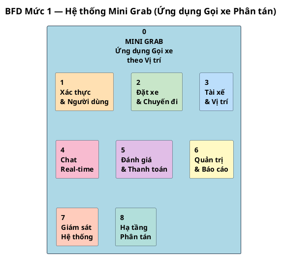
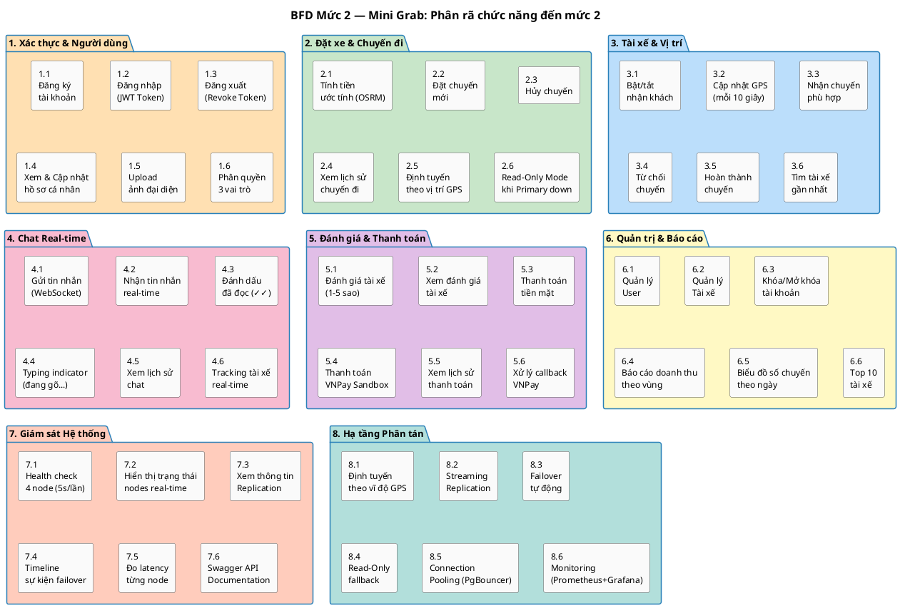

# BÁO CÁO KỸ THUẬT — ĐỀ TÀI 4
## Ứng dụng Gọi xe theo Vị trí — Cơ sở Dữ liệu Phân tán

> **Môn học:** Cơ sở Dữ liệu Phân tán
> **Đề tài:** Đề tài 4 — Ứng dụng Gọi xe theo Vị trí
> **Nhóm:** 9 người | **Thời gian:** 6 tuần

---

# PHẦN 1 — MÔ TẢ CHI TIẾT BÀI TOÁN CỦA TOÀN BỘ DỰ ÁN

## 1.1. Bối cảnh và Vấn đề đặt ra

Trong các ứng dụng gọi xe thời gian thực, độ trễ mạng là yếu tố ảnh hưởng trực tiếp đến trải nghiệm người dùng. Khi người dùng tại TP.HCM phải kết nối đến máy chủ đặt tại Hà Nội, độ trễ có thể lên đến 50–100ms, gây ra hiện tượng giật lag khi cập nhật vị trí tài xế theo thời gian thực, chậm trễ khi đặt chuyến và nhận chuyến, và trải nghiệm chat không mượt mà.

Giải pháp được áp dụng là **phân tán dữ liệu theo vị trí địa lý**: dữ liệu của người dùng Miền Bắc được lưu trữ và xử lý tại Server Miền Bắc, dữ liệu của người dùng Miền Nam được lưu trữ và xử lý tại Server Miền Nam. Mỗi khu vực có thêm một Server dự phòng (Replica) để đảm bảo tính sẵn sàng cao.

## 1.2. Kiến trúc Tổng thể Hệ thống

Hệ thống Mini Grab được xây dựng theo kiến trúc 3 tầng:

```
┌─────────────────────────────────────────────────────────────────┐
│                        CLIENT LAYER                              │
│                                                                   │
│   [Web Admin - React + Vite]      [Mobile App - React Native]    │
│   • Quản lý hệ thống              • Khách hàng đặt xe            │
│   • Báo cáo doanh thu             • Tài xế nhận chuyến           │
│   • Monitor DB nodes              • Chat real-time               │
│   • Quản lý thanh toán            • Xem lịch sử chuyến           │
└──────────────────────┬────────────────────────┬──────────────────┘
                       │ REST API + WebSocket    │
                       ▼                         ▼
┌─────────────────────────────────────────────────────────────────┐
│                      BACKEND LAYER                               │
│              NestJS + TypeScript + Node.js v20                   │
│                                                                   │
│  Auth │ Trips │ Drivers │ Messages │ Ratings │ Payments          │
│  Admin │ Health │ Reports │ Location Router │ DB Routing         │
│                                                                   │
│  WebSocket Gateways: TripsGateway (/) + MessagesGateway (/chat)  │
│  Swagger API Docs: http://localhost:3000/api/docs                 │
└──────────────────────────────┬──────────────────────────────────┘
                               │
              ┌────────────────┼────────────────┐
              ▼                                  ▼
┌─────────────────────┐              ┌─────────────────────┐
│     MIỀN BẮC        │              │     MIỀN NAM        │
│  (latitude > 16.0)  │              │  (latitude ≤ 16.0)  │
│                     │              │                     │
│  pg-north-primary   │              │  pg-south-primary   │
│  Port: 5432         │              │  Port: 5434         │
│  (Ghi + Đọc)        │              │  (Ghi + Đọc)        │
│         │           │              │         │           │
│  Streaming          │              │  Streaming          │
│  Replication        │              │  Replication        │
│         ▼           │              │         ▼           │
│  pg-north-replica   │              │  pg-south-replica   │
│  Port: 5433         │              │  Port: 5435         │
│  (Chỉ Đọc)          │              │  (Chỉ Đọc)          │
└─────────────────────┘              └─────────────────────┘
         │                                      │
         ▼                                      ▼
┌─────────────────────┐              ┌─────────────────────┐
│  PgBouncer Pool     │              │  PgBouncer Pool     │
│  (Connection Pool)  │              │  (Connection Pool)  │
└─────────────────────┘              └─────────────────────┘
         │                                      │
         └──────────────┬───────────────────────┘
                        ▼
              ┌─────────────────┐
              │   Prometheus    │
              │   + Grafana     │
              │  (Monitoring)   │
              └─────────────────┘
```

## 1.3. Các Yêu cầu Kỹ thuật Cốt lõi

### Yêu cầu 1 — Định tuyến theo Vị trí

Hệ thống tự động xác định khu vực của người dùng dựa trên tọa độ GPS hoặc lựa chọn thành phố, sau đó kết nối đến đúng Server khu vực tương ứng.

**Logic định tuyến** (file `location.utils.ts` và `location-router.service.ts`):
- Vĩ độ (latitude) > 16.0 → **NORTH** (Hà Nội và các tỉnh phía Bắc)
- Vĩ độ (latitude) ≤ 16.0 → **SOUTH** (TP.HCM và các tỉnh phía Nam)
- Ranh giới tương đương khu vực Đà Nẵng

**Hai cách nhập vị trí:**
1. Nhập tọa độ GPS trực tiếp (latitude, longitude)
2. Chọn thành phố từ danh sách (hệ thống tự map sang tọa độ)

**Log backend** ghi rõ: `READ REGION: north` hoặc `READ REGION: south` mỗi khi có request.

### Yêu cầu 2 — Master-Slave Replication

Mỗi khu vực có 2 node PostgreSQL 15:
- **Primary (Master)**: Nhận cả đọc và ghi
- **Replica (Slave)**: Chỉ đọc, đồng bộ dữ liệu từ Primary qua **PostgreSQL Streaming Replication**

Cấu hình replication:
```
wal_level = replica
max_wal_senders = 10
wal_keep_size = 128MB
hot_standby = on
```

Replica sử dụng `pg_basebackup` để khởi tạo và duy trì đồng bộ liên tục qua WAL (Write-Ahead Log).

### Yêu cầu 3 — Cơ chế Failover Tự động

Khi Primary sập, hệ thống **tự động** chuyển sang Replica mà không cần can thiệp thủ công.

**Cơ chế hoạt động** (file `database.service.ts`):
```
queryWithFailover(region, query, values, isWriteRequest):
  1. Thử kết nối Primary
  2. Nếu Primary thất bại:
     - isWriteRequest = true  → Throw lỗi DATABASE_PRIMARY_DOWN_{region}
     - isWriteRequest = false → Chuyển sang Replica (Read-Only mode)
  3. Nếu cả Primary và Replica đều sập → Throw DATABASE_CLUSTER_DOWN_{region}
```

**Health Service** ping tất cả 4 node mỗi **5 giây**, đọc `pg_stat_replication`, và ghi lại timeline các sự kiện thay đổi trạng thái.

**Log rõ ràng:**
- `[SOUTH Primary Down] Chuyển Read-Only: <error message>`
- `[SOUTH Replica Down] Toàn cụm sập: <error message>`
- `[HealthMonitor] Status changed: southPrimary: online → offline`

### Yêu cầu 4 — Chế độ Read-Only

Khi Primary sập, Replica vẫn phục vụ các request đọc. Hệ thống trả về flag `readOnly: true` trong response, và UI hiển thị cảnh báo rõ ràng.

**Hành vi theo từng loại request:**

| Loại request | Primary UP | Primary DOWN |
|---|---|---|
| Đặt chuyến mới (POST /trips/book) | ✅ Thành công | ❌ Lỗi 503 |
| Xem lịch sử chuyến (GET /trips/history) | ✅ Từ Primary | ✅ Từ Replica (readOnly: true) |
| Cập nhật vị trí tài xế | ✅ Thành công | ❌ Lỗi, tắt GPS tracking |
| Xem tài xế gần nhất | ✅ Từ Primary | ✅ Từ Replica (readOnly: true) |
| Xem lịch sử chat | ✅ Từ Primary | ✅ Từ Replica (readOnly: true) |

**UI xử lý Read-Only:**
- Mobile: Hiển thị banner vàng cảnh báo, disable nút "Đặt xe"
- Web Dashboard: Hiển thị warning banner `⚠️ Hệ thống đang trong chế độ chỉ đọc`
- Chat: Disable ô nhập tin nhắn, hiển thị `⚠️ Chế độ chỉ đọc — Không thể gửi tin nhắn mới`

### Yêu cầu 5 — Test Cases

Xem chi tiết tại Phần 4 của tài liệu này.

## 1.4. Techstack

| Layer | Công nghệ |
|---|---|
| Runtime | Node.js v20 LTS |
| Backend Framework | NestJS + TypeScript |
| DB Driver | raw pg (node-postgres) + TypeORM |
| Database | PostgreSQL 15 |
| Connection Pool | PgBouncer |
| Web Frontend | React + TypeScript + Vite |
| Mobile | React Native + TypeScript + Expo |
| Real-time | Socket.IO (WebSocket) |
| API Docs | Swagger (@nestjs/swagger) |
| Infrastructure | Docker + Docker Compose |
| Monitoring | Prometheus + Grafana |
| API Style | REST + WebSocket |
| Version Control | Git + GitHub |

## 1.5. Ba Role trong Hệ thống

| Role | Platform | Chức năng chính |
|---|---|---|
| **Khách hàng** | Mobile + Web | Đặt xe, xem lịch sử, đánh giá tài xế, thanh toán |
| **Tài xế** | Mobile | Nhận/từ chối chuyến, cập nhật vị trí GPS, chat với khách |
| **Admin** | Web only | Quản lý user/tài xế, monitor DB nodes, xem báo cáo doanh thu |

## 1.6. Schema Cơ sở Dữ liệu

### Bảng `users` — Người dùng

```sql
CREATE TABLE users (
  id                SERIAL PRIMARY KEY,
  name              VARCHAR(100) NOT NULL,
  phone             VARCHAR(20),
  email             VARCHAR(100) UNIQUE,
  password          VARCHAR(255),           -- bcrypt hash
  role              VARCHAR(20) DEFAULT 'customer'
                    CHECK (role IN ('customer', 'driver', 'admin')),
  preferred_language VARCHAR(5) DEFAULT 'vi'
                    CHECK (preferred_language IN ('vi', 'en')),
  avatar_url        VARCHAR(255),
  created_at        TIMESTAMP DEFAULT NOW(),
  updated_at        TIMESTAMP DEFAULT NOW()
);
```

### Bảng `drivers` — Tài xế

```sql
CREATE TABLE drivers (
  id            UUID PRIMARY KEY DEFAULT gen_random_uuid(),
  user_id       INT REFERENCES users(id) ON DELETE CASCADE,
  vehicle_plate VARCHAR(20),
  vehicle_type  VARCHAR(10) DEFAULT 'bike'
                CHECK (vehicle_type IN ('car', 'bike', 'truck')),
  is_available  BOOLEAN DEFAULT false,
  latitude      DOUBLE PRECISION,
  longitude     DOUBLE PRECISION,
  region        VARCHAR(10) DEFAULT 'NORTH'
                CHECK (region IN ('NORTH', 'SOUTH')),
  rating        NUMERIC(3,2) DEFAULT 5.0,
  total_trips   INT DEFAULT 0,
  created_at    TIMESTAMP DEFAULT NOW()
);

-- Indexes
CREATE INDEX idx_drivers_available_region ON drivers(is_available, region);
CREATE INDEX idx_drivers_location ON drivers(latitude, longitude);
```

### Bảng `trips` — Chuyến đi

```sql
CREATE TABLE trips (
  id               SERIAL PRIMARY KEY,
  customer_id      INT REFERENCES users(id),
  driver_id        UUID REFERENCES drivers(id),
  status           VARCHAR(20) DEFAULT 'pending'
                   CHECK (status IN ('pending','accepted','completed','cancelled')),
  pickup_address   VARCHAR(255),
  dropoff_address  VARCHAR(255),
  pickup_lat       DOUBLE PRECISION,
  pickup_lng       DOUBLE PRECISION,
  dropoff_lat      DOUBLE PRECISION,
  dropoff_lng      DOUBLE PRECISION,
  region           VARCHAR(10) CHECK (region IN ('NORTH', 'SOUTH')),
  distance_km      NUMERIC(10,2),
  fare             DECIMAL(10,2),
  created_at       TIMESTAMP DEFAULT NOW(),
  completed_at     TIMESTAMP
);

-- Index
CREATE INDEX idx_trips_status_region ON trips(status, region);
```

### Bảng `messages` — Tin nhắn Chat

```sql
CREATE TABLE messages (
  id          UUID PRIMARY KEY DEFAULT gen_random_uuid(),
  trip_id     INT REFERENCES trips(id) ON DELETE CASCADE,
  sender_id   INT REFERENCES users(id),
  receiver_id INT REFERENCES users(id),
  content     TEXT NOT NULL,
  type        VARCHAR(10) DEFAULT 'text' CHECK (type IN ('text', 'image')),
  is_read     BOOLEAN DEFAULT false,
  created_at  TIMESTAMP DEFAULT NOW()
);

-- Index
CREATE INDEX idx_messages_trip_id ON messages(trip_id, created_at);
```

### Bảng `ratings` — Đánh giá

```sql
CREATE TABLE ratings (
  id          SERIAL PRIMARY KEY,
  trip_id     INT REFERENCES trips(id),
  customer_id INT REFERENCES users(id),
  driver_id   UUID REFERENCES drivers(id),
  score       INT CHECK (score BETWEEN 1 AND 5),
  comment     TEXT,
  created_at  TIMESTAMP DEFAULT NOW()
);
```

### Bảng `payments` — Thanh toán

```sql
CREATE TABLE payments (
  id                    SERIAL PRIMARY KEY,
  trip_id               INT REFERENCES trips(id),
  amount                DECIMAL(10,2),
  method                VARCHAR(10) CHECK (method IN ('cash', 'vnpay')),
  status                VARCHAR(20) CHECK (status IN ('pending','completed','failed')),
  vnpay_transaction_id  VARCHAR(100),
  created_at            TIMESTAMP DEFAULT NOW()
);
```

## 1.7. Toàn bộ API Endpoints

### Auth Module (`/auth`)

| Method | Endpoint | Mô tả | Auth |
|---|---|---|---|
| POST | `/auth/register` | Đăng ký tài khoản | ❌ |
| POST | `/auth/login` | Đăng nhập → JWT token | ❌ |
| POST | `/auth/logout` | Đăng xuất (revoke token) | ✅ |
| GET | `/auth/me` | Thông tin user hiện tại | ✅ |
| PATCH | `/auth/me` | Cập nhật hồ sơ | ✅ |
| POST | `/auth/me/avatar` | Upload ảnh đại diện | ✅ |

### Drivers Module (`/drivers`)

| Method | Endpoint | Mô tả | Auth |
|---|---|---|---|
| PATCH | `/drivers/location` | Cập nhật vị trí GPS | ✅ |
| PATCH | `/drivers/availability` | Bật/tắt nhận khách | ✅ |
| GET | `/drivers/nearby` | Tìm tài xế gần nhất | ❌ |
| GET | `/drivers/by-user/:userId` | Lấy driver record theo user | ✅ |
| GET | `/drivers/:id` | Thông tin tài xế theo ID | ❌ |

### Trips Module (`/trips`)

| Method | Endpoint | Mô tả | Auth |
|---|---|---|---|
| POST | `/trips/book` | Đặt chuyến mới | ✅ |
| POST | `/trips/estimate` | Tính tiền ước tính (OSRM) | ❌ |
| GET | `/trips/pending` | Danh sách chuyến chờ nhận | ✅ |
| PATCH | `/trips/:id/accept` | Tài xế nhận chuyến | ✅ |
| PATCH | `/trips/:id/complete` | Hoàn thành chuyến | ✅ |
| PATCH | `/trips/:id/reject` | Từ chối chuyến | ✅ |
| GET | `/trips/history` | Lịch sử chuyến của user | ✅ |
| GET | `/trips/history/:userId` | Admin xem lịch sử user | ✅ Admin |

### Messages Module (`/messages`)

| Method | Endpoint | Mô tả | Auth |
|---|---|---|---|
| GET | `/messages/unread/count` | Đếm tin nhắn chưa đọc | ✅ |
| GET | `/messages/:trip_id` | Lịch sử chat của 1 chuyến | ✅ |

### Ratings Module (`/ratings`)

| Method | Endpoint | Mô tả | Auth |
|---|---|---|---|
| POST | `/ratings` | Đánh giá tài xế (1–5 sao) | ✅ |
| GET | `/ratings/driver/:id` | Xem đánh giá của tài xế | ✅ |

### Payments Module (`/payments`)

| Method | Endpoint | Mô tả | Auth |
|---|---|---|---|
| POST | `/payments/create` | Tạo thanh toán (cash/vnpay) | ✅ |
| GET | `/payments/callback` | VNPay callback | ❌ |
| GET | `/payments/:trip_id` | Trạng thái thanh toán | ✅ |
| GET | `/payments/history` | Lịch sử thanh toán user | ✅ |
| GET | `/payments/admin/all` | Admin xem tất cả giao dịch | ✅ |

### Admin Module (`/admin`)

| Method | Endpoint | Mô tả | Auth |
|---|---|---|---|
| GET | `/admin/users` | Danh sách tất cả user | ✅ |
| GET | `/admin/drivers` | Danh sách tài xế (lọc theo region) | ✅ |
| PATCH | `/admin/users/:id/suspend` | Khóa tài khoản | ✅ |
| PATCH | `/admin/users/:id/unsuspend` | Mở khóa tài khoản | ✅ |
| DELETE | `/admin/users/:id` | Xóa user | ✅ |

### Health Module (`/health`)

| Method | Endpoint | Mô tả | Auth |
|---|---|---|---|
| GET | `/health` | Trạng thái đầy đủ 4 node + replication | ❌ |
| GET | `/health/north` | Chi tiết Miền Bắc | ❌ |
| GET | `/health/south` | Chi tiết Miền Nam | ❌ |
| GET | `/health/history` | Timeline sự kiện failover | ❌ |

### Reports Module (`/reports`)

| Method | Endpoint | Mô tả | Auth |
|---|---|---|---|
| GET | `/reports/revenue` | Doanh thu theo vùng | ❌ |
| GET | `/reports/trips` | Số chuyến theo ngày | ❌ |
| GET | `/reports/drivers/top` | Top 10 tài xế | ❌ |

## 1.8. WebSocket Gateways

### TripsGateway (Namespace mặc định `/`)

Phục vụ real-time tracking vị trí tài xế và cập nhật trạng thái chuyến.

| Event (Client → Server) | Mô tả |
|---|---|
| `trip:join` | Vào phòng theo dõi chuyến |
| `trip:leave` | Rời phòng |
| `driver:location` | Tài xế gửi vị trí GPS |

| Event (Server → Client) | Mô tả |
|---|---|
| `trip:accepted` | Thông báo tài xế đã nhận chuyến |
| `trip:status` | Cập nhật trạng thái chuyến |
| `driver:location` | Broadcast vị trí tài xế |
| `connection:ready` | Xác nhận kết nối thành công |

### MessagesGateway (Namespace `/chat`)

Phục vụ chat real-time giữa khách hàng và tài xế. Yêu cầu JWT authentication khi kết nối.

| Event (Client → Server) | Mô tả |
|---|---|
| `join:trip` | Vào phòng chat của chuyến |
| `message:send` | Gửi tin nhắn |
| `message:read` | Đánh dấu đã đọc |
| `typing` | Thông báo đang gõ |

| Event (Server → Client) | Mô tả |
|---|---|
| `message:receive` | Nhận tin nhắn mới |
| `message:read` | Xác nhận đã đọc |
| `typing` | Thông báo đối phương đang gõ |
| `connected` | Xác nhận kết nối + userId |
| `error` | Thông báo lỗi |

## 1.9. Màn hình Mobile (React Native + Expo)

| Màn hình | Mô tả |
|---|---|
| **LoginScreen** | Đăng nhập email/password, hỗ trợ VI/EN |
| **RegisterScreen** | Đăng ký với role (customer/driver/admin) |
| **ProfileScreen** | Xem/sửa hồ sơ, upload ảnh đại diện |
| **DriverHomeScreen** | Toggle sẵn sàng nhận khách, GPS tracking 10s, xem thông tin xe |
| **ChatScreen** | Chat real-time, typing indicator, ✓✓ đã đọc, warning read-only |
| **BookingScreen** | Đặt xe với bản đồ, tính tiền ước tính qua OSRM |
| **AcceptTripScreen** | Tài xế xem và nhận/từ chối chuyến |
| **TripTrackingScreen** | Khách theo dõi tài xế real-time |

## 1.10. Trang Web Admin (React + Vite)

| Trang | Mô tả |
|---|---|
| **Login/Register/Profile** | Xác thực và quản lý hồ sơ |
| **Dashboard** | Biểu đồ doanh thu (BarChart), số chuyến theo ngày (LineChart), top tài xế |
| **SystemMonitor** | Trạng thái 4 node real-time, topology map, replication status, event timeline |
| **AdminUsers** | Quản lý user: tìm kiếm, khóa/mở khóa, xóa |
| **AdminDrivers** | Quản lý tài xế: lọc theo region, xem trạng thái |
| **AdminPayments** | Lịch sử giao dịch, lọc theo trạng thái |

## 1.11. Monitoring và Observability

Hệ thống tích hợp stack monitoring đầy đủ:

- **Prometheus**: Thu thập metrics từ 4 PostgreSQL exporters (port 9187–9190)
- **Grafana** (port 3001): Dashboard visualize số connection, replication lag, query performance
- **Health API**: Endpoint `/health` trả về trạng thái chi tiết 4 node, response time, replication info
- **Event Timeline**: Ghi lại 100 sự kiện thay đổi trạng thái gần nhất (server-side + client-side)

---
# BÁO CÁO KỸ THUẬT — ĐỀ TÀI 4
## Ứng dụng Gọi xe theo Vị trí — Cơ sở Dữ liệu Phân tán

> **Môn học:** Cơ sở Dữ liệu Phân tán
> **Nhóm:** 9 người
> **Tên dự án:** Mini Grab

---

# PHẦN 1 — MÔ TẢ CHI TIẾT BÀI TOÁN CỦA TOÀN BỘ DỰ ÁN

## 1.1 Bối cảnh và Vấn đề

Trong các ứng dụng gọi xe thời gian thực, độ trễ mạng là yếu tố ảnh hưởng trực tiếp đến trải nghiệm người dùng. Khi người dùng tại TP.HCM phải kết nối đến máy chủ đặt tại Hà Nội, độ trễ tăng cao làm chậm toàn bộ luồng đặt xe — từ lúc nhấn "Đặt xe" đến khi tài xế nhận được yêu cầu.

Bài toán đặt ra: **Xây dựng hệ thống gọi xe phân tán theo vị trí địa lý**, trong đó:
- Dữ liệu được phân vùng theo tọa độ GPS (Miền Bắc / Miền Nam)
- Mỗi vùng có máy chủ riêng để giảm độ trễ
- Khi một máy chủ gặp sự cố, hệ thống tự động chuyển sang máy chủ dự phòng
- Người dùng vẫn xem được lịch sử chuyến đi ngay cả khi máy chủ chính bị sập

## 1.2 Kiến trúc Tổng thể

Hệ thống gồm 3 tầng chính:

```
┌─────────────────────────────────────────────────────────────┐
│                        CLIENT LAYER                          │
│                                                              │
│   [Web Admin — React + Vite]    [Mobile App — React Native]  │
│   • Quản lý hệ thống            • Khách hàng đặt xe          │
│   • Báo cáo doanh thu           • Tài xế nhận chuyến         │
│   • Monitor DB nodes            • Chat real-time             │
│   • Quản lý user/driver         • Xem lịch sử chuyến         │
└──────────────────────┬──────────────────────────────────────┘
                       │ REST API + WebSocket
                       ▼
┌─────────────────────────────────────────────────────────────┐
│                      BACKEND LAYER                           │
│              NestJS + TypeScript + Node.js                   │
│                                                              │
│  Auth │ Trips │ Drivers │ Messages │ Ratings │ Payments      │
│  Admin │ Health │ Reports │ DB-Routing │ Location Router     │
│                                                              │
│  WebSocket Gateways: TripsGateway + MessagesGateway(/chat)   │
│  Swagger Docs: http://localhost:3000/api/docs                │
└──────────────────────┬──────────────────────────────────────┘
                       │
          ┌────────────┴────────────┐
          ▼                         ▼
┌──────────────────┐     ┌──────────────────┐
│   MIỀN BẮC       │     │   MIỀN NAM        │
│  (lat > 16.0)    │     │  (lat ≤ 16.0)     │
│                  │     │                   │
│ pg-north-primary │     │ pg-south-primary  │
│   port 5432      │     │   port 5434       │
│   (Ghi + Đọc)   │     │   (Ghi + Đọc)    │
│       │          │     │       │           │
│  streaming repl  │     │  streaming repl   │
│       ▼          │     │       ▼           │
│ pg-north-replica │     │ pg-south-replica  │
│   port 5433      │     │   port 5435       │
│   (Chỉ Đọc)     │     │   (Chỉ Đọc)      │
└──────────────────┘     └──────────────────┘
```

## 1.3 Techstack

| Tầng | Công nghệ |
|------|-----------|
| Runtime | Node.js v20 LTS |
| Backend Framework | NestJS + TypeScript |
| DB Driver | raw `pg` (node-postgres) + TypeORM |
| Database | PostgreSQL 15 |
| Web Frontend | React + TypeScript + Vite |
| Mobile | React Native + TypeScript + Expo |
| Real-time | Socket.IO (WebSocket) |
| Infrastructure | Docker + Docker Compose |
| Connection Pooling | PgBouncer |
| Monitoring | Prometheus + Grafana |
| API Docs | Swagger (`@nestjs/swagger`) |
| API Style | REST + WebSocket |
| Version Control | Git + GitHub |

## 1.4 Ba vai trò trong hệ thống

| Vai trò | Nền tảng | Chức năng chính |
|---------|----------|-----------------|
| Khách hàng | Mobile + Web | Đặt xe, xem lịch sử, đánh giá, thanh toán |
| Tài xế | Mobile | Nhận/từ chối chuyến, cập nhật vị trí GPS, chat |
| Admin | Web only | Quản lý user/driver, monitor DB nodes, xem báo cáo |

## 1.5 Cơ chế Phân tán Cốt lõi

### 1.5.1 Định tuyến theo Vị trí (Location Router)

Mỗi request đến backend đều mang theo tọa độ GPS hoặc thông tin vùng. Backend tự động xác định region:

```
latitude > 16.0  →  NORTH  →  pg-north-primary (port 5432)
latitude ≤ 16.0  →  SOUTH  →  pg-south-primary (port 5434)
```

Ranh giới vĩ độ 16.0 tương đương khu vực Đà Nẵng — phân chia tự nhiên Miền Bắc và Miền Nam Việt Nam.

**Hai cách nhập vị trí:**
1. **Chọn thành phố từ dropdown** — Hà Nội → NORTH, TP.HCM → SOUTH
2. **Nhập tọa độ thủ công** — lat/lng → tự động xác định region

**Log backend khi định tuyến:**
```
READ REGION: north  →  Route đến pg-north-primary
READ REGION: south  →  Route đến pg-south-primary
```

### 1.5.2 Master-Slave Replication (Nhân bản dữ liệu)

Mỗi region có 1 cặp Primary–Replica:
- **Primary**: Nhận cả đọc và ghi
- **Replica**: Chỉ đọc, đồng bộ dữ liệu từ Primary qua **PostgreSQL Streaming Replication**

Cấu hình replication:
```sql
-- Trên Primary:
wal_level = replica
max_wal_senders = 10
wal_keep_size = 128MB
hot_standby = on

-- Replica tự động kết nối:
pg_basebackup -h pg-north-primary -D /data -U replicator -Fp -Xs -R
```

Kiểm tra replication đang chạy:
```sql
SELECT * FROM pg_stat_replication;
-- Phải thấy 2 dòng (1 cho Bắc, 1 cho Nam)
```

### 1.5.3 Cơ chế Failover Tự động

`DatabaseService` quản lý 4 connection pool riêng biệt. Hàm `queryWithFailover()` xử lý toàn bộ logic:

```
Request đến backend
    │
    ├─ isWriteRequest = true?
    │       ├─ Primary UP → Ghi vào Primary ✅
    │       └─ Primary DOWN → Throw DATABASE_PRIMARY_DOWN_[REGION] ❌
    │
    └─ isWriteRequest = false?
            ├─ Primary UP → Đọc từ Primary ✅ (isReadOnly = false)
            ├─ Primary DOWN → Fallback sang Replica ⚠️ (isReadOnly = true)
            └─ Cả 2 DOWN → Throw DATABASE_CLUSTER_DOWN_[REGION] ❌
```

**Thời gian failover:** Dưới 3 giây (connectionTimeoutMillis = 3000ms)

**Log khi failover:**
```
[SOUTH Primary Down] Chuyển Read-Only: connection refused
[SOUTH Primary Down] GHI LỖI: connection refused
[SOUTH Replica Down] Toàn cụm sập: connection refused
```

### 1.5.4 Chế độ Read-Only

Khi Primary sập, mọi response API đều trả về flag `readOnly`:

```json
{
  "readOnly": true,
  "warning": "Hệ thống đang trong chế độ chỉ đọc. Không thể đặt chuyến mới.",
  "activeNode": "southReplica",
  "data": [...]
}
```

**Hành vi UI khi read-only:**
- Banner cảnh báo màu vàng hiển thị trên tất cả màn hình
- Nút "Đặt xe" bị disable
- Lịch sử chuyến vẫn load bình thường từ Replica
- Chat vẫn xem được lịch sử, không gửi được tin mới
- Khi Primary phục hồi → tự động trở về full mode

### 1.5.5 Health Monitor (Giám sát sức khỏe)

`HealthService` ping tất cả 4 node mỗi **5 giây**:
- Đo response time (ms) của từng node
- Đọc `pg_stat_replication` từ Primary để kiểm tra replication lag
- Ghi lại timeline các sự kiện thay đổi trạng thái (lưu 100 sự kiện gần nhất)
- Xác định service level: `full` / `readonly` / `unavailable`

## 1.6 Schema Cơ sở Dữ liệu

### Bảng `users` — Người dùng (Global, lưu ở North Primary)
| Cột | Kiểu | Mô tả |
|-----|------|-------|
| id | SERIAL PK | ID tự tăng |
| name | VARCHAR(100) | Họ tên |
| phone | VARCHAR(20) | Số điện thoại |
| email | VARCHAR(100) UNIQUE | Email đăng nhập |
| password | VARCHAR(255) | Mật khẩu đã hash (bcrypt) |
| role | VARCHAR(20) | `customer` / `driver` / `admin` |
| preferred_language | VARCHAR(5) | `vi` / `en` |
| avatar_url | VARCHAR(255) | Đường dẫn ảnh đại diện |
| created_at, updated_at | TIMESTAMP | Thời gian tạo/cập nhật |

### Bảng `drivers` — Tài xế (Phân vùng theo region)
| Cột | Kiểu | Mô tả |
|-----|------|-------|
| id | UUID PK | ID dạng UUID |
| user_id | INT FK → users | Liên kết tài khoản |
| vehicle_plate | VARCHAR(20) | Biển số xe |
| vehicle_type | VARCHAR(10) | `car` / `bike` / `truck` |
| is_available | BOOLEAN | Đang sẵn sàng nhận khách |
| latitude, longitude | DOUBLE PRECISION | Tọa độ GPS hiện tại |
| region | VARCHAR(10) | `NORTH` / `SOUTH` |
| rating | NUMERIC(3,2) | Điểm đánh giá trung bình |
| total_trips | INT | Tổng số chuyến đã chạy |

**Index:** `idx_drivers_available_region(is_available, region)`, `idx_drivers_location(latitude, longitude)`

### Bảng `trips` — Chuyến đi (Phân vùng theo region)
| Cột | Kiểu | Mô tả |
|-----|------|-------|
| id | SERIAL PK | ID chuyến |
| customer_id | INT FK → users | Khách hàng |
| driver_id | UUID FK → drivers | Tài xế nhận chuyến |
| status | VARCHAR(20) | `pending` / `accepted` / `completed` / `cancelled` |
| pickup_address, dropoff_address | VARCHAR(255) | Địa chỉ đón/trả |
| pickup_lat/lng, dropoff_lat/lng | DOUBLE PRECISION | Tọa độ đón/trả |
| region | VARCHAR(10) | `NORTH` / `SOUTH` |
| distance_km | NUMERIC(10,2) | Khoảng cách (km) |
| fare | DECIMAL(10,2) | Giá tiền (VNĐ) |
| created_at, completed_at | TIMESTAMP | Thời gian tạo/hoàn thành |

**Index:** `idx_trips_status_region(status, region)`

### Bảng `messages` — Tin nhắn Chat (Phân vùng theo region của trip)
| Cột | Kiểu | Mô tả |
|-----|------|-------|
| id | UUID PK | ID tin nhắn |
| trip_id | INT FK → trips | Thuộc chuyến nào |
| sender_id, receiver_id | INT FK → users | Người gửi/nhận |
| content | TEXT | Nội dung tin nhắn |
| type | VARCHAR(10) | `text` / `image` |
| is_read | BOOLEAN | Đã đọc chưa |
| created_at | TIMESTAMP | Thời gian gửi |

**Index:** `idx_messages_trip_id(trip_id, created_at)`

### Bảng `ratings` — Đánh giá Tài xế
| Cột | Kiểu | Mô tả |
|-----|------|-------|
| id | SERIAL PK | ID đánh giá |
| trip_id | INT FK → trips | Chuyến được đánh giá |
| customer_id | INT FK → users | Khách hàng đánh giá |
| driver_id | UUID FK → drivers | Tài xế được đánh giá |
| score | INT | Điểm 1–5 |
| comment | TEXT | Nhận xét |
| created_at | TIMESTAMP | Thời gian đánh giá |

### Bảng `payments` — Thanh toán
| Cột | Kiểu | Mô tả |
|-----|------|-------|
| id | SERIAL PK | ID thanh toán |
| trip_id | INT FK → trips | Chuyến thanh toán |
| amount | DECIMAL | Số tiền |
| method | VARCHAR | `cash` / `vnpay` |
| status | VARCHAR | `pending` / `completed` / `failed` |
| vnpay_transaction_id | VARCHAR | Mã giao dịch VNPay |
| created_at | TIMESTAMP | Thời gian tạo |

## 1.7 Toàn bộ API Endpoints

### Auth (`/auth`)
| Method | Endpoint | Mô tả | Auth |
|--------|----------|-------|------|
| POST | `/auth/register` | Đăng ký tài khoản | ❌ |
| POST | `/auth/login` | Đăng nhập → JWT token | ❌ |
| POST | `/auth/logout` | Đăng xuất (revoke token) | ✅ |
| GET | `/auth/me` | Thông tin user hiện tại | ✅ |
| PATCH | `/auth/me` | Cập nhật hồ sơ | ✅ |
| POST | `/auth/me/avatar` | Upload ảnh đại diện | ✅ |

### Drivers (`/drivers`)
| Method | Endpoint | Mô tả | Auth |
|--------|----------|-------|------|
| PATCH | `/drivers/location` | Cập nhật GPS (10s/lần) | ✅ |
| PATCH | `/drivers/availability` | Bật/tắt nhận khách | ✅ |
| GET | `/drivers/nearby` | Tìm tài xế gần nhất | ❌ |
| GET | `/drivers/by-user/:userId` | Lấy driver_id theo user | ✅ |
| GET | `/drivers/:id` | Thông tin tài xế theo ID | ❌ |

### Trips (`/trips`)
| Method | Endpoint | Mô tả | Auth |
|--------|----------|-------|------|
| POST | `/trips/book` | Đặt chuyến mới | ✅ |
| POST | `/trips/estimate` | Tính tiền ước tính (OSRM) | ❌ |
| GET | `/trips/pending` | Danh sách chuyến chờ nhận | ✅ |
| PATCH | `/trips/:id/accept` | Tài xế nhận chuyến | ✅ |
| PATCH | `/trips/:id/complete` | Hoàn thành chuyến | ✅ |
| PATCH | `/trips/:id/reject` | Từ chối chuyến | ✅ |
| GET | `/trips/history` | Lịch sử chuyến của user | ✅ |
| GET | `/trips/history/:userId` | Admin xem lịch sử user | ✅ Admin |

### Messages (`/messages`)
| Method | Endpoint | Mô tả | Auth |
|--------|----------|-------|------|
| GET | `/messages/unread/count` | Đếm tin nhắn chưa đọc | ✅ |
| GET | `/messages/:trip_id` | Lịch sử chat của 1 chuyến | ✅ |

### Ratings (`/ratings`)
| Method | Endpoint | Mô tả | Auth |
|--------|----------|-------|------|
| POST | `/ratings` | Đánh giá tài xế (1–5 sao) | ✅ |
| GET | `/ratings/driver/:id` | Xem đánh giá của tài xế | ✅ |

### Payments (`/payments`)
| Method | Endpoint | Mô tả | Auth |
|--------|----------|-------|------|
| POST | `/payments/create` | Tạo thanh toán (cash/vnpay) | ✅ |
| GET | `/payments/callback` | VNPay callback | ❌ |
| GET | `/payments/:trip_id` | Trạng thái thanh toán | ✅ |
| GET | `/payments/history` | Lịch sử thanh toán user | ✅ |
| GET | `/payments/admin/all` | Tất cả giao dịch (admin) | ✅ |

### Admin (`/admin`)
| Method | Endpoint | Mô tả | Auth |
|--------|----------|-------|------|
| GET | `/admin/users` | Danh sách tất cả user | ✅ |
| GET | `/admin/drivers` | Danh sách tài xế (lọc theo region) | ✅ |
| PATCH | `/admin/users/:id/suspend` | Khóa tài khoản | ✅ |
| PATCH | `/admin/users/:id/unsuspend` | Mở khóa tài khoản | ✅ |
| DELETE | `/admin/users/:id` | Xóa user | ✅ |

### Health (`/health`)
| Method | Endpoint | Mô tả | Auth |
|--------|----------|-------|------|
| GET | `/health` | Trạng thái đầy đủ 4 node | ❌ |
| GET | `/health/north` | Chi tiết Miền Bắc | ❌ |
| GET | `/health/south` | Chi tiết Miền Nam | ❌ |
| GET | `/health/history` | Timeline sự kiện failover | ❌ |

### Reports (`/reports`)
| Method | Endpoint | Mô tả | Auth |
|--------|----------|-------|------|
| GET | `/reports/revenue` | Doanh thu theo vùng | ❌ |
| GET | `/reports/trips` | Số chuyến theo ngày | ❌ |
| GET | `/reports/drivers/top` | Top 10 tài xế | ❌ |

### Swagger Docs
```
http://localhost:3000/api/docs
```

## 1.8 WebSocket Gateways

### TripsGateway (namespace mặc định `/`)
Phục vụ real-time tracking chuyến đi:

| Event (Client → Server) | Mô tả |
|-------------------------|-------|
| `trip:join` | Vào phòng theo dõi chuyến |
| `trip:leave` | Rời phòng |
| `driver:location` | Tài xế gửi tọa độ GPS |

| Event (Server → Client) | Mô tả |
|-------------------------|-------|
| `trip:accepted` | Tài xế đã nhận chuyến |
| `trip:status` | Cập nhật trạng thái chuyến |
| `driver:location` | Broadcast vị trí tài xế |
| `connection:ready` | Xác nhận kết nối |

### MessagesGateway (namespace `/chat`)
Phục vụ chat real-time giữa khách và tài xế:

| Event (Client → Server) | Mô tả |
|-------------------------|-------|
| `join:trip` | Vào phòng chat của chuyến |
| `message:send` | Gửi tin nhắn |
| `message:read` | Đánh dấu đã đọc |
| `typing` | Đang gõ... |

| Event (Server → Client) | Mô tả |
|-------------------------|-------|
| `message:receive` | Nhận tin nhắn mới |
| `message:read` | Xác nhận đã đọc |
| `typing` | Thông báo đang gõ |
| `connected` | Xác thực JWT thành công |
| `error` | Lỗi kết nối/xác thực |

**Xác thực WebSocket:** JWT token truyền qua `handshake.auth.token` hoặc `Authorization` header.

## 1.9 Màn hình Mobile (React Native + Expo)

| Màn hình | Vai trò | Chức năng |
|----------|---------|-----------|
| LoginScreen | Tất cả | Đăng nhập email/password |
| RegisterScreen | Tất cả | Đăng ký tài khoản, chọn role |
| ProfileScreen | Tất cả | Xem/sửa hồ sơ, upload avatar |
| DriverHomeScreen | Tài xế | Toggle sẵn sàng, GPS tracking 10s |
| ChatScreen | Tài xế + Khách | Chat real-time, typing indicator, ✓✓ đã đọc |
| BookingScreen | Khách | Đặt xe trên bản đồ, tính tiền OSRM |
| AcceptTripScreen | Tài xế | Danh sách chuyến chờ, nhận/từ chối |
| TripTrackingScreen | Khách | Theo dõi tài xế real-time |

## 1.10 Trang Web Admin (React + Vite)

| Trang | Đường dẫn | Chức năng |
|-------|-----------|-----------|
| Login | `/login` | Đăng nhập |
| Register | `/register` | Đăng ký |
| Profile | `/profile` | Hồ sơ cá nhân |
| Dashboard | `/dashboard` | Biểu đồ doanh thu, top tài xế |
| System Monitor | `/monitor` | Giám sát 4 node real-time |
| Admin | `/admin` | Quản lý user, driver, payments |

## 1.11 Hạ tầng Docker

```
Docker Compose khởi động:
├── pg-north-primary    (port 5432) — PostgreSQL 15, WAL replication
├── pg-north-replica    (port 5433) — Streaming replica từ north-primary
├── pg-south-primary    (port 5434) — PostgreSQL 15, WAL replication
├── pg-south-replica    (port 5435) — Streaming replica từ south-primary
├── prometheus          (port 9090) — Thu thập metrics
├── grafana             (port 3001) — Dashboard visualize
├── postgres-exporter × 4           — Export metrics từng node
└── pgbouncer × 4 (optional)        — Connection pooling
```

## 1.12 Test Cases Bắt buộc

| TC | Tên | Thao tác | Kết quả mong đợi |
|----|-----|----------|------------------|
| TC-01 | Định tuyến theo thành phố | Chọn "Hà Nội" | Kết nối pg-north-primary |
| TC-02 | Định tuyến theo tọa độ | Nhập lat=10.77, lng=106.70 | Kết nối pg-south-primary |
| TC-03 | Replication hoạt động | INSERT vào north-primary | Trip xuất hiện ở north-replica trong < 1 giây |
| TC-04 | Failover tự động | `docker stop pg-south-primary` | Trong 5–10 giây tự chuyển sang south-replica |
| TC-05 | Read-only mode | Primary down → thử đặt chuyến | Lỗi rõ ràng, không crash app |
| TC-06 | Xem lịch sử khi failover | Primary down → xem lịch sử | Vẫn load được từ replica |
| TC-07 | Cross-region isolation | Tắt Miền Nam → request Miền Bắc | Miền Bắc vẫn hoạt động bình thường |
| TC-08 | Cả 2 node cùng down | Tắt primary + replica Miền Nam | Báo lỗi rõ ràng, không crash |
| TC-09 | Phục hồi tự động | `docker start pg-south-primary` | Sau 5–10 giây tự về full mode |
| TC-10 | Health API | GET /health khi 1 node down | Trả đúng trạng thái 4 node |

---

# PHẦN 2 — SƠ ĐỒ CHỨC NĂNG BFD (Business Function Diagram) ĐẾN MỨC 2

> Sơ đồ BFD dưới đây được viết bằng PlantUML. Dán vào https://www.plantuml.com/plantuml/uml/ để render.

## 2.1 Sơ đồ BFD Tổng thể — Mức 1



---

## 2.2 Sơ đồ BFD Chi tiết — Mức 2



---

## 2.3 Sơ đồ BFD dạng cây — Toàn bộ hệ thống

```plantuml
@startuml BFD_Tree_MiniGrab
skinparam defaultFontSize 12
skinparam defaultFontName Arial
skinparam ArrowColor #2c3e50
skinparam RectangleBorderColor #2c3e50

title BFD Dạng cây — Mini Grab (Mức 0 → Mức 2)

rectangle "**0. MINI GRAB**\nỨng dụng Gọi xe Phân tán" as ROOT #2980b9 {
}

' Level 1
rectangle "**1. Xác thực**\n& Người dùng" as L1_1 #e67e22
rectangle "**2. Đặt xe**\n& Chuyến đi" as L1_2 #27ae60
rectangle "**3. Tài xế**\n& Vị trí" as L1_3 #2980b9
rectangle "**4. Chat**\nReal-time" as L1_4 #e91e63
rectangle "**5. Đánh giá**\n& Thanh toán" as L1_5 #9b59b6
rectangle "**6. Quản trị**\n& Báo cáo" as L1_6 #f39c12
rectangle "**7. Giám sát**\nHệ thống" as L1_7 #e74c3c
rectangle "**8. Hạ tầng**\nPhân tán" as L1_8 #16a085

ROOT --> L1_1
ROOT --> L1_2
ROOT --> L1_3
ROOT --> L1_4
ROOT --> L1_5
ROOT --> L1_6
ROOT --> L1_7
ROOT --> L1_8

' Level 2 — Chức năng 1
rectangle "1.1 Đăng ký" as L2_11
rectangle "1.2 Đăng nhập" as L2_12
rectangle "1.3 Đăng xuất" as L2_13
rectangle "1.4 Cập nhật hồ sơ" as L2_14
rectangle "1.5 Upload avatar" as L2_15
rectangle "1.6 Phân quyền" as L2_16

L1_1 --> L2_11
L1_1 --> L2_12
L1_1 --> L2_13
L1_1 --> L2_14
L1_1 --> L2_15
L1_1 --> L2_16

' Level 2 — Chức năng 2
rectangle "2.1 Tính tiền OSRM" as L2_21
rectangle "2.2 Đặt chuyến" as L2_22
rectangle "2.3 Hủy chuyến" as L2_23
rectangle "2.4 Lịch sử chuyến" as L2_24
rectangle "2.5 Định tuyến GPS" as L2_25
rectangle "2.6 Read-Only Mode" as L2_26

L1_2 --> L2_21
L1_2 --> L2_22
L1_2 --> L2_23
L1_2 --> L2_24
L1_2 --> L2_25
L1_2 --> L2_26

' Level 2 — Chức năng 3
rectangle "3.1 Bật/tắt nhận khách" as L2_31
rectangle "3.2 Cập nhật GPS 10s" as L2_32
rectangle "3.3 Nhận chuyến" as L2_33
rectangle "3.4 Từ chối chuyến" as L2_34
rectangle "3.5 Hoàn thành chuyến" as L2_35
rectangle "3.6 Tìm tài xế gần" as L2_36

L1_3 --> L2_31
L1_3 --> L2_32
L1_3 --> L2_33
L1_3 --> L2_34
L1_3 --> L2_35
L1_3 --> L2_36

' Level 2 — Chức năng 4
rectangle "4.1 Gửi tin nhắn" as L2_41
rectangle "4.2 Nhận real-time" as L2_42
rectangle "4.3 Đánh dấu đọc" as L2_43
rectangle "4.4 Typing indicator" as L2_44
rectangle "4.5 Lịch sử chat" as L2_45
rectangle "4.6 Tracking tài xế" as L2_46

L1_4 --> L2_41
L1_4 --> L2_42
L1_4 --> L2_43
L1_4 --> L2_44
L1_4 --> L2_45
L1_4 --> L2_46

' Level 2 — Chức năng 5
rectangle "5.1 Đánh giá 1-5 sao" as L2_51
rectangle "5.2 Xem đánh giá" as L2_52
rectangle "5.3 Thanh toán tiền mặt" as L2_53
rectangle "5.4 Thanh toán VNPay" as L2_54
rectangle "5.5 Lịch sử thanh toán" as L2_55
rectangle "5.6 Callback VNPay" as L2_56

L1_5 --> L2_51
L1_5 --> L2_52
L1_5 --> L2_53
L1_5 --> L2_54
L1_5 --> L2_55
L1_5 --> L2_56

' Level 2 — Chức năng 6
rectangle "6.1 Quản lý User" as L2_61
rectangle "6.2 Quản lý Tài xế" as L2_62
rectangle "6.3 Khóa/Mở khóa" as L2_63
rectangle "6.4 Báo cáo doanh thu" as L2_64
rectangle "6.5 Biểu đồ chuyến" as L2_65
rectangle "6.6 Top tài xế" as L2_66

L1_6 --> L2_61
L1_6 --> L2_62
L1_6 --> L2_63
L1_6 --> L2_64
L1_6 --> L2_65
L1_6 --> L2_66

' Level 2 — Chức năng 7
rectangle "7.1 Health check 5s" as L2_71
rectangle "7.2 Hiển thị node" as L2_72
rectangle "7.3 Xem Replication" as L2_73
rectangle "7.4 Timeline failover" as L2_74
rectangle "7.5 Đo latency" as L2_75
rectangle "7.6 Swagger Docs" as L2_76

L1_7 --> L2_71
L1_7 --> L2_72
L1_7 --> L2_73
L1_7 --> L2_74
L1_7 --> L2_75
L1_7 --> L2_76

' Level 2 — Chức năng 8
rectangle "8.1 Định tuyến vĩ độ" as L2_81
rectangle "8.2 Streaming Repl." as L2_82
rectangle "8.3 Failover tự động" as L2_83
rectangle "8.4 Read-Only fallback" as L2_84
rectangle "8.5 PgBouncer Pool" as L2_85
rectangle "8.6 Prometheus+Grafana" as L2_86

L1_8 --> L2_81
L1_8 --> L2_82
L1_8 --> L2_83
L1_8 --> L2_84
L1_8 --> L2_85
L1_8 --> L2_86

@enduml
```



---

## 2.4 Bảng tổng hợp BFD — Mức 2

| Mức 1 | Mức 2 | API / Thành phần tương ứng |
|-------|-------|---------------------------|
| **1. Xác thực & Người dùng** | 1.1 Đăng ký | `POST /auth/register` |
| | 1.2 Đăng nhập | `POST /auth/login` → JWT |
| | 1.3 Đăng xuất | `POST /auth/logout` |
| | 1.4 Cập nhật hồ sơ | `GET/PATCH /auth/me` |
| | 1.5 Upload avatar | `POST /auth/me/avatar` |
| | 1.6 Phân quyền | JwtAuthGuard, role: customer/driver/admin |
| **2. Đặt xe & Chuyến đi** | 2.1 Tính tiền OSRM | `POST /trips/estimate` |
| | 2.2 Đặt chuyến | `POST /trips/book` |
| | 2.3 Hủy chuyến | `PATCH /trips/:id/cancel-legacy` |
| | 2.4 Lịch sử chuyến | `GET /trips/history` |
| | 2.5 Định tuyến GPS | `LocationRouterService`, `determineRegionFromLocation()` |
| | 2.6 Read-Only Mode | `queryWithFailover()` → `isReadOnly: true` |
| **3. Tài xế & Vị trí** | 3.1 Bật/tắt nhận khách | `PATCH /drivers/availability` |
| | 3.2 Cập nhật GPS 10s | `PATCH /drivers/location` + Expo Location |
| | 3.3 Nhận chuyến | `PATCH /trips/:id/accept` |
| | 3.4 Từ chối chuyến | `PATCH /trips/:id/reject` |
| | 3.5 Hoàn thành chuyến | `PATCH /trips/:id/complete` |
| | 3.6 Tìm tài xế gần | `GET /drivers/nearby` + earthdistance |
| **4. Chat Real-time** | 4.1 Gửi tin nhắn | WS `message:send` → MessagesGateway |
| | 4.2 Nhận real-time | WS `message:receive` broadcast |
| | 4.3 Đánh dấu đọc | WS `message:read` |
| | 4.4 Typing indicator | WS `typing` event |
| | 4.5 Lịch sử chat | `GET /messages/:trip_id` |
| | 4.6 Tracking tài xế | WS `driver:location` → TripsGateway |
| **5. Đánh giá & Thanh toán** | 5.1 Đánh giá 1–5 sao | `POST /ratings` |
| | 5.2 Xem đánh giá | `GET /ratings/driver/:id` |
| | 5.3 Thanh toán tiền mặt | `POST /payments/create` (method: cash) |
| | 5.4 Thanh toán VNPay | `POST /payments/create` (method: vnpay) |
| | 5.5 Lịch sử thanh toán | `GET /payments/history` |
| | 5.6 Callback VNPay | `GET /payments/callback` |
| **6. Quản trị & Báo cáo** | 6.1 Quản lý User | `GET/DELETE /admin/users` |
| | 6.2 Quản lý Tài xế | `GET /admin/drivers?region=` |
| | 6.3 Khóa/Mở khóa | `PATCH /admin/users/:id/suspend|unsuspend` |
| | 6.4 Báo cáo doanh thu | `GET /reports/revenue` |
| | 6.5 Biểu đồ chuyến | `GET /reports/trips` |
| | 6.6 Top tài xế | `GET /reports/drivers/top` |
| **7. Giám sát Hệ thống** | 7.1 Health check 5s | `HealthService.updateStatuses()` |
| | 7.2 Hiển thị node | `GET /health` → SystemMonitor UI |
| | 7.3 Xem Replication | `pg_stat_replication` query |
| | 7.4 Timeline failover | `GET /health/history` |
| | 7.5 Đo latency | `checkDatabase()` → responseTimeMs |
| | 7.6 Swagger Docs | `http://localhost:3000/api/docs` |
| **8. Hạ tầng Phân tán** | 8.1 Định tuyến vĩ độ | `latitude > 16.0 → NORTH, else SOUTH` |
| | 8.2 Streaming Replication | PostgreSQL WAL, `pg_basebackup` |
| | 8.3 Failover tự động | `queryWithFailover()` trong DatabaseService |
| | 8.4 Read-Only fallback | Replica pool khi Primary down |
| | 8.5 PgBouncer Pool | Connection pooling (transaction mode) |
| | 8.6 Prometheus + Grafana | Metrics từ 4 postgres-exporter |

---

## 2.5 Ghi chú về Phạm vi Đề tài

Theo yêu cầu đề tài, các chức năng **cốt lõi** liên quan đến CSDL Phân tán gồm:

| Yêu cầu | Chức năng BFD | Trạng thái |
|---------|---------------|------------|
| Định tuyến theo vị trí | 2.5, 8.1 | ✅ Hoàn thành |
| Master-Slave Replication | 8.2 | ✅ Hoàn thành |
| Cơ chế Failover | 8.3 | ✅ Hoàn thành |
| Read-Only Mode | 2.6, 8.4 | ✅ Hoàn thành |
| Test Cases | TC-01 đến TC-10 | ✅ Đã định nghĩa |

Các chức năng **mở rộng** (không tính điểm đề tài nhưng tốt cho CV):

| Chức năng | Ghi chú |
|-----------|---------|
| Chat WebSocket (4.x) | Tính năng thực tế, không liên quan CSDL phân tán |
| Thanh toán VNPay (5.4) | Tính năng thực tế, không liên quan CSDL phân tán |
| Tracking GPS real-time (4.6) | Tính năng thực tế, không liên quan CSDL phân tán |
| Swagger API Docs (7.6) | Hỗ trợ demo và tài liệu |
| Prometheus + Grafana (8.6) | Monitoring nâng cao |

---

*Tài liệu này được tổng hợp từ toàn bộ source code của dự án Mini Grab.*
*Phiên bản: 1.0 — Ngày cập nhật: 2026*
