# PHẦN 1: MÔ TẢ CHI TIẾT BÀI TOÁN DỰ ÁN

## 1. Bối cảnh và yêu cầu bài toán
Trong các hệ thống gọi xe trực tuyến, việc truyền tải dữ liệu vị trí và cập nhật trạng thái chuyến đi đòi hỏi độ trễ ở mức tối thiểu để đảm bảo tính đồng bộ theo thời gian thực. Đối với một hệ thống có phạm vi hoạt động rộng, việc sử dụng một máy chủ cơ sở dữ liệu tập trung (Centralized Database) thường phát sinh hạn chế về độ trễ mạng (network latency), đặc biệt đối với người dùng ở xa trung tâm lưu trữ dữ liệu.

Nhằm giải quyết vấn đề này, giải pháp được đưa ra là áp dụng kiến trúc cơ sở dữ liệu phân tán theo vị trí địa lý. Cụ thể, dữ liệu và luồng xử lý được chia thành các khu vực riêng biệt (ví dụ: Miền Bắc và Miền Nam). Người dùng tại khu vực nào sẽ kết nối trực tiếp đến cụm máy chủ xử lý của khu vực đó. Giải pháp này giúp giảm thiểu độ trễ truy vấn, tối ưu hóa thời gian phản hồi và tăng cường khả năng chịu lỗi (fault tolerance) cho toàn bộ hệ thống.

## 2. Kiến trúc tổng thể
Hệ thống được thiết kế theo kiến trúc 3 phân lớp (3-Tier Architecture) đảm bảo tính mở rộng và độc lập giữa các thành phần:
- **Lớp Client:** Giao diện tương tác người dùng, bao gồm ứng dụng di động dành cho khách hàng và tài xế (phát triển bằng React Native) cùng trang quản trị Web (phát triển bằng ReactJS).
- **Lớp Backend API:** Đóng vai trò tiếp nhận, xử lý logic nghiệp vụ và định tuyến luồng dữ liệu. Lớp này tiếp nhận yêu cầu từ Client và định hướng đến cơ sở dữ liệu phù hợp (sử dụng framework NestJS).
- **Lớp Cơ sở dữ liệu phân tán:** Bao gồm các cụm máy chủ PostgreSQL được phân bổ theo khu vực địa lý. Tại mỗi khu vực, cơ sở dữ liệu được thiết lập theo mô hình Master-Slave nhằm đảm bảo tính toàn vẹn và khả năng dự phòng.

## 3. Cơ chế hoạt động cốt lõi
- **Định tuyến theo vị trí địa lý (Location-based Routing):** Hệ thống phân tích tọa độ định vị (GPS) từ thiết bị của người dùng để xác định khu vực hiện tại, qua đó tự động kết nối đến cụm máy chủ cục bộ (ví dụ: Vĩ độ > 16.0 cho Miền Bắc, Vĩ độ <= 16.0 cho Miền Nam).
- **Đồng bộ và Nhân bản dữ liệu (Replication):** Mỗi cụm máy chủ khu vực bao gồm một máy chủ chính (Primary) xử lý các tác vụ đọc/ghi và một máy chủ dự phòng (Replica) ở chế độ chỉ đọc. Dữ liệu được đồng bộ liên tục và xuyên suốt từ Primary sang Replica thông qua cơ chế Streaming Replication của hệ quản trị cơ sở dữ liệu.
- **Dự phòng sự cố (Auto Failover):** Trong trường hợp máy chủ Primary gặp sự cố hoặc ngừng hoạt động, hệ thống định tuyến tự động phát hiện và chuyển hướng các truy vấn sang máy chủ Replica để duy trì tính sẵn sàng.
- **Chế độ hoạt động Chỉ đọc (Read-Only Mode):** Khi chuyển sang trạng thái Failover (sử dụng máy chủ Replica), hệ thống sẽ tạm dừng các tác vụ thay đổi dữ liệu (như đặt chuyến mới, cập nhật tọa độ) và duy trì các tác vụ tra cứu (như xem lịch sử, thông tin chuyến đi) để đảm bảo hệ thống không bị gián đoạn hoàn toàn đối với người dùng.

## 4. Các thực thể dữ liệu chính
Hệ thống quản lý các luồng dữ liệu chính bao gồm:
- **Người dùng (Users):** Quản lý thông tin định danh của khách hàng, tài xế và quản trị viên.
- **Tài xế (Drivers):** Trạng thái hoạt động, tọa độ định vị và thông tin phương tiện.
- **Chuyến đi (Trips):** Lưu trữ lộ trình, chi phí tính toán và tiến trình hoàn thành chuyến đi.
- **Tương tác (Messages):** Lưu trữ luồng trao đổi thông tin trực tuyến giữa khách hàng và tài xế.
- **Giao dịch (Payments):** Ghi nhận trạng thái thanh toán và luồng tiền.

---

# PHẦN 2: SƠ ĐỒ CHỨC NĂNG BFD (Business Function Diagram)

Dưới đây là cấu trúc phân rã chức năng hệ thống đến mức 2, được định dạng theo cấu trúc phân cấp để dễ dàng chuyển đổi thành sơ đồ (SmartArt/Hierarchy) trong Microsoft Word.

**0. HỆ THỐNG GỌI XE THEO VỊ TRÍ**

**1. Quản lý Người dùng và Xác thực**
   - 1.1. Đăng ký tài khoản hệ thống
   - 1.2. Xác thực và đăng nhập
   - 1.3. Quản lý hồ sơ cá nhân
   - 1.4. Phân quyền truy cập hệ thống

**2. Quản lý Chuyến đi**
   - 2.1. Tính toán chi phí và lộ trình ước lượng
   - 2.2. Khởi tạo yêu cầu chuyến đi
   - 2.3. Hủy và điều chỉnh yêu cầu
   - 2.4. Tra cứu lịch sử chuyến đi

**3. Quản lý Hoạt động Tài xế**
   - 3.1. Cập nhật trạng thái nhận chuyến (On/Off)
   - 3.2. Cập nhật và đồng bộ tọa độ GPS
   - 3.3. Tiếp nhận hoặc từ chối chuyến đi
   - 3.4. Xác nhận hoàn thành lộ trình

**4. Tương tác và Theo dõi Trực tuyến**
   - 4.1. Nhắn tin trao đổi nội bộ
   - 4.2. Giám sát vị trí tài xế theo thời gian thực

**5. Đánh giá và Thanh toán**
   - 5.1. Xử lý thanh toán chuyến đi
   - 5.2. Ghi nhận đánh giá chất lượng dịch vụ
   - 5.3. Tra cứu lịch sử giao dịch

**6. Quản trị và Giám sát Hệ thống**
   - 6.1. Quản lý danh mục tài khoản (Khách/Tài xế)
   - 6.2. Thống kê và báo cáo doanh thu
   - 6.3. Giám sát trạng thái và hiệu suất máy chủ phân tán

---
*Ghi chú: Để vẽ sơ đồ trực quan và chuyên nghiệp trong Word, bạn có thể copy danh sách phân cấp (0 -> 6) ở trên, sử dụng tính năng **Insert > SmartArt > Hierarchy (Sơ đồ tổ chức)** và dán đoạn text vào khung Text Pane.*

*(Tùy chọn) Mã nguồn PlantUML để tạo ảnh sơ đồ chuẩn (đen trắng, tối giản, chuyên nghiệp):*

```plantuml
@startuml
skinparam rectangle {
  BackgroundColor White
  BorderColor Black
  FontColor Black
  Shadowing false
}
skinparam ArrowColor Black
skinparam defaultTextAlignment center

rectangle "0. HỆ THỐNG GỌI XE THEO VỊ TRÍ" as ROOT

rectangle "1. Quản lý\nNgười dùng" as F1
rectangle "2. Quản lý\nChuyến đi" as F2
rectangle "3. Quản lý\nTài xế" as F3
rectangle "4. Tương tác\nTrực tuyến" as F4
rectangle "5. Thanh toán\nvà Đánh giá" as F5
rectangle "6. Quản trị\nvà Giám sát" as F6

ROOT --> F1
ROOT --> F2
ROOT --> F3
ROOT --> F4
ROOT --> F5
ROOT --> F6

rectangle "1.1 Đăng ký" as F11
rectangle "1.2 Đăng nhập" as F12
rectangle "1.3 Hồ sơ" as F13
rectangle "1.4 Phân quyền" as F14
F1 --> F11
F1 --> F12
F1 --> F13
F1 --> F14

rectangle "2.1 Tính phí" as F21
rectangle "2.2 Đặt chuyến" as F22
rectangle "2.3 Hủy chuyến" as F23
rectangle "2.4 Lịch sử" as F24
F2 --> F21
F2 --> F22
F2 --> F23
F2 --> F24

rectangle "3.1 Trạng thái" as F31
rectangle "3.2 Tọa độ GPS" as F32
rectangle "3.3 Nhận chuyến" as F33
rectangle "3.4 Hoàn thành" as F34
F3 --> F31
F3 --> F32
F3 --> F33
F3 --> F34

rectangle "4.1 Nhắn tin" as F41
rectangle "4.2 Theo dõi vị trí" as F42
F4 --> F41
F4 --> F42

rectangle "5.1 Thanh toán" as F51
rectangle "5.2 Đánh giá" as F52
rectangle "5.3 Lịch sử GD" as F53
F5 --> F51
F5 --> F52
F5 --> F53

rectangle "6.1 QL Tài khoản" as F61
rectangle "6.2 Thống kê" as F62
rectangle "6.3 Trạng thái Node" as F63
F6 --> F61
F6 --> F62
F6 --> F63
@enduml
```

